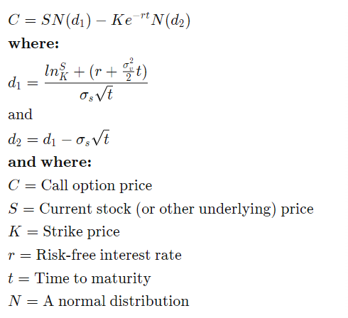

# Black-Scholes formula

The black-Scholes formula is a mathmatical equation that estimates the theoretical value of options taking into account
of time and other risk factors.

It requires five input variables including Strike price, current stock price, time till expiry, risk-free rate and 
volatility.

The standard formula only applies to european options and not american options. This is because european options can only be
exercised on the settlement date whereas american options can be exercised any time before. Tweaks to the formula have
been made to the formula so you can implement it on american options

# Assumptions
The formula makes various assumptions which are:

- No dividends are paid out during the life of the option
- Markets are random 
- Doesn't account for transaction costs
- The risk-free rate and volatility of the underlying assets are known and constant
- The returns of the underlying asset are normally distributed
- The options are european and can only be exercised at expiration

# Formula

# Definitions
- Strike price: The price at which the underlying security can be bought/sold. Different to current stock price.
- Current asset price: The current asset price
- Time till expiry: When the option expires. For european options you can only exercise them on the expiry date. For 
american options you can exercise them before
- Risk-free rate:
- Volatility: